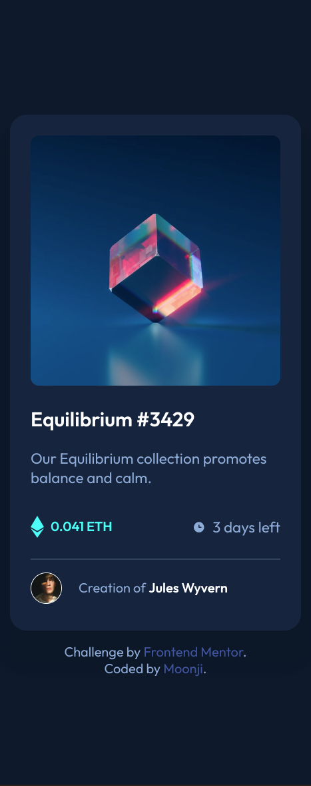

# Frontend Mentor - NFT preview card component solution

This is a solution to the [NFT preview card component challenge on Frontend Mentor](https://www.frontendmentor.io/challenges/nft-preview-card-component-SbdUL_w0U). Frontend Mentor challenges help you improve your coding skills by building realistic projects. 

## Table of contents

- [Overview](#overview)
  - [The challenge](#the-challenge)
  - [Screenshot](#screenshot)
  - [Links](#links)
- [My process](#my-process)
  - [Built with](#built-with)
  - [What I learned](#what-i-learned)
  - [Continued development](#continued-development)
  - [Useful resources](#useful-resources)
- [Author](#author)
- [Acknowledgments](#acknowledgments)

## Overview

### The challenge

Users should be able to:

- View the optimal layout depending on their device's screen size
- See hover states for interactive elements

### Screenshot

<ins> Frontend Mentor's Desktop Design </ins>:


<ins> My Desktop Solution </ins>:


<ins> Frontend Mentor's Mobile Design </ins>


<ins> My Mobile Solution </ins>



### Links

- Solution URL: [Github](https://github.com/moonji-spoonji/NFT-Preview-Component)
- Live Site URL: [Netlify](https://nft-preview-card-comp-moonji.netlify.app/)

## My process

### Built with

- Semantic HTML5 markup
- CSS custom properties
- Flexbox
- CSS Grid

### What I learned

#### CSS
I learned to create a semi-transparent overlay with an icon in the middle. It was difficult to figure out but thankfully ChatGPT helped out me out with it lol.  

```css
.img-container {
  width: 300px;
  height: 300px;
  position: relative;
  display: inline-block;
}

.img-container .nft {
  display: block;
  position: inherit;
  width: 100%;
  height: auto;
}

.img-container::after {
  content: "";
  position: absolute;
  
  /* adjust the positioning of the area covered*/
  top: 0;
  left: 0;
  right: 0;
  bottom: 0;

  background-color: var(--cyan); 
  opacity: 0;
  transition: opacity 0.3s ease; /* a smooth transition for the overlay */

  /* centers the eye/view svg */
  display: flex;
  justify-content: center;
  align-items: center
  border-radius: 1rem;

}

.img-container:hover::after {
  opacity: 1; /* makes the effect visible */
  content: url("./images/icon-view.svg"); /* the eye icon */
}
```

### Continued development

In the future I would like to play around with transforms and transitions to embelish pages with, especially when it comes to mouse events.

### Useful resources

- [ChatGPT](https://chatgpt.com/) - This tool has helped me in a variety of ways for quite some time, but this time it helped me with writing and understanding how to create a semi-translucent overlay for an image.  

## Author

- Github - [moonji-spoonji](https://github.com/moonji-spoonji)
- Frontend Mentor - [@moonji-spoonji](https://www.frontendmentor.io/profile/moonji-spoonji)

## Acknowledgments

I tip my hat to good ole Chad (ChatGPT) for helping me out on this project, the hovering feature in particular. What a wise and generous guy! He explained everything so well and kindly. 
